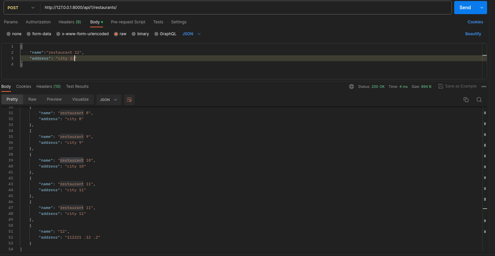
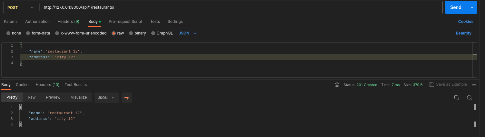
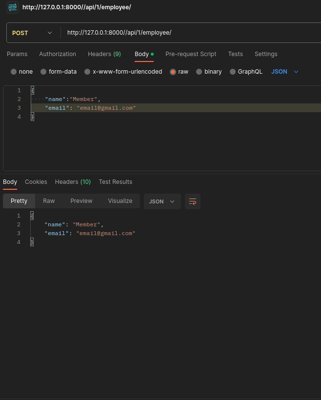
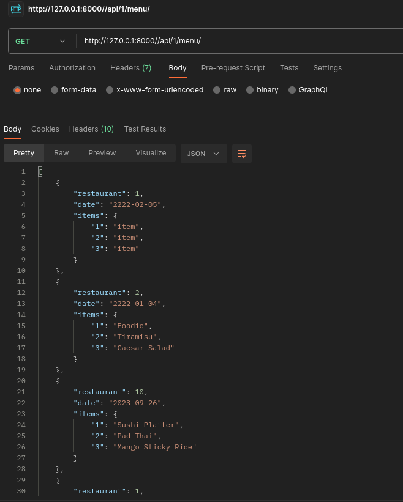
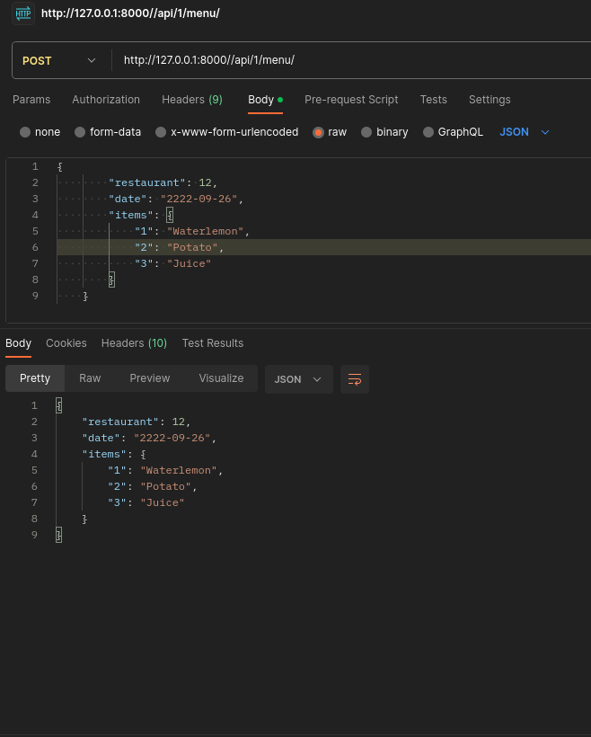
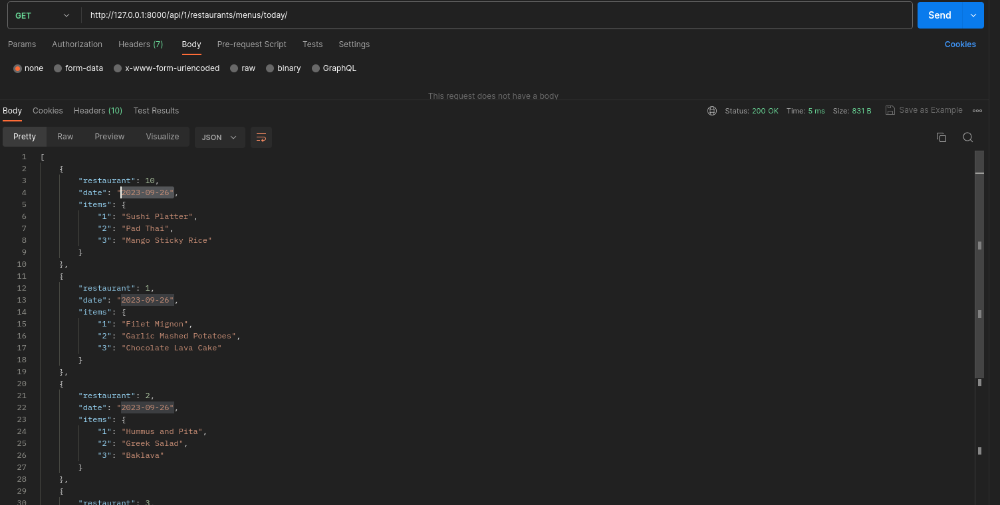
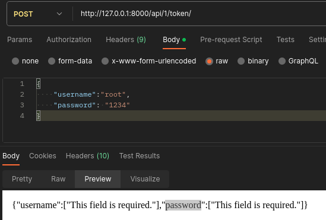
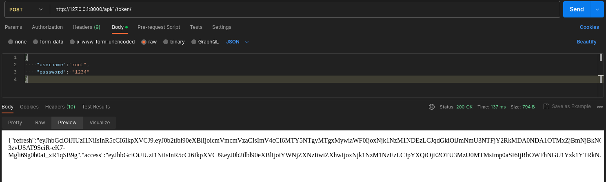

# MealVote-Api

## Description

MealVote-Api is a Django project that provides various functionalities related to restaurant management. This README guide will walk you through the steps required to set up and run the system locally.

## Prerequisites

Before you begin, ensure you have met the following requirements:

- **Python**: MealVote-Api requires Python [insert version] to be installed on your system.
- **Django**: Make sure you have Django [insert version] installed.
- **Additional Dependencies**: Install additional project dependencies by running `pip install -r requirements.txt` from the project directory.

## Installation

Follow these steps to set up and run MealVote-Api:

1. Clone the repository:

   ```bash
   git clone git@github.com:Petrovych9/MealVote-Api.git
    ```
2. Navigate to the project directory:

   ```bash
   cd MealVote-Api
   ```
3. Create a virtual environment (recommended) and activate it:
     ```bash
    python -m venv venv
    source venv/bin/activate
    ```
4. Install project dependencies:
    ```bash
    pip install -r requirements.txt
    ```
5. Apply database migrations:
    ```bash
    python manage.py migrate
    ```
6. Start the development server:
    ```bash
    python manage.py runserver
    ```


## Usage

Once the server is running, you can access the MealVote-Api using your web browser or API client. Here are some of the available endpoints and functionalities:

- **Authentication**: MealVote-Api provides authentication using [insert authentication method, e.g., token-based authentication]. You can obtain a token by sending a POST request to `/api/1/token/`. Use the obtained token for authentication in subsequent requests.


- **Creating Restaurant**: To create a new restaurant, send a POST request to `/api/1/restaurants/`.
    
  - before: 
  - after: 


- **Creating Employee**: To create a new employee, send a POST request to `/api/1/employee/`.
  - GET all: 
  - POST create new member:  

- **Uploading Menu for Restaurant**: To upload a menu for a restaurant, send a POST request to `/api/1/menu/`.
  - GET all: 
  - POST create new menu:  


- **Getting Current Day Menu**: To retrieve the menu for the current day, send a GET request to `/api/1/restaurants/menus/today/`.
  - result: 


#### Obtain Authentication Token
To obtain an authentication token, you can send a POST as below:



